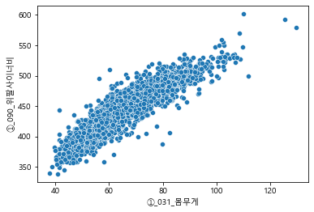
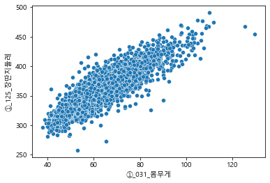
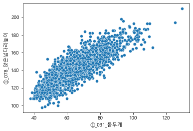
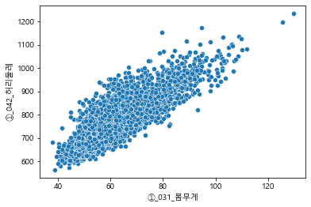
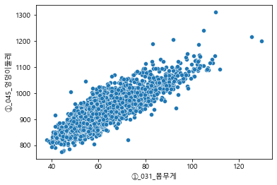

# Linear Regression for Body Size Data with EDA

[**제7차 한국인 인체치수조사사업의 2015년 인채 치수 데이터**](https://sizekorea.kr/page/data/1_1)를 사용한 선형 회귀 모델

## Abstract

  
  

  
  

  
  

  

### 선택한 독립 변수

독립 변수간 공선성(Multicollinearity) 제거 후 몸무게와 상관관계가 높은 순으로 배열 후 몸무게와 상관관계가 높은 순으로 특징 5개를 선택하였습니다
 

### 종속변수(몸무게)와 독립변수의 피어슨 상관관계

①_090_위팔사이너비     0.911542 
①_125_장딴지둘레      0.860970 
①_078_앉은넙다리높이    0.851376 
①_042_허리둘레       0.835230 
①_045_엉덩이둘레      0.830420 

### 회귀 계수(Regression Coefficient)

[-70.05208072,   0.30543816]

[-79.55801415,   0.17713632,   0.12346398,   0.14868915]

[-8.64710256e+01,  1.31017384e-01,  9.04301165e-02,  9.17168518e-02,  2.63240698e-02,  2.81656539e-02]
 

### 평가 지표 (evaluation metrics) 계산

RSS : 83716.22675727124
RMSE : 5.110025458478456

RSS : 46697.66647407502
RMSE : 3.817100306528689

RSS : 29460.99626490051
RMSE : 3.032336969798772
 

## Library

- scipy
- sklearn
- statsmodels

## Data

[제7차 한국인 인체치수조사사업의 2015년 인채 치수 데이터](https://sizekorea.kr/page/data/1_1)

## Evaluation Metrics

RMSE(Root Mean Squared Error)

## Description

Linear Regression is descripted as RSS(Residual Sum of Squares), PCC(Pearson Correlation Coefficient), R^2(R-squared), t-statistic, F-statistic
